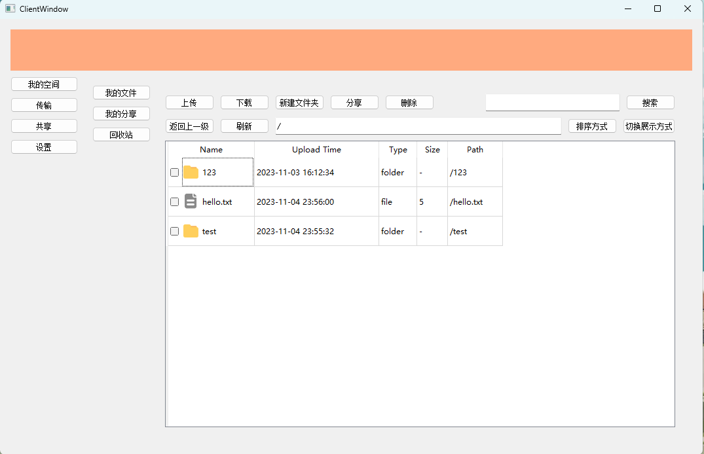
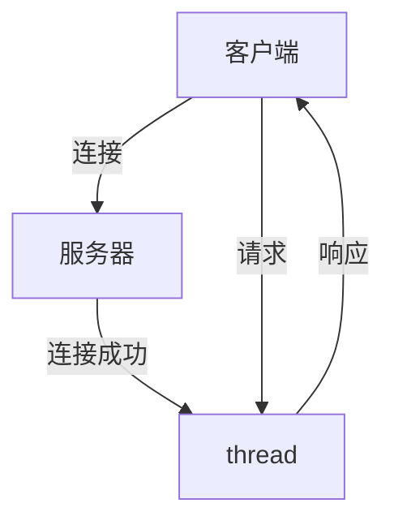
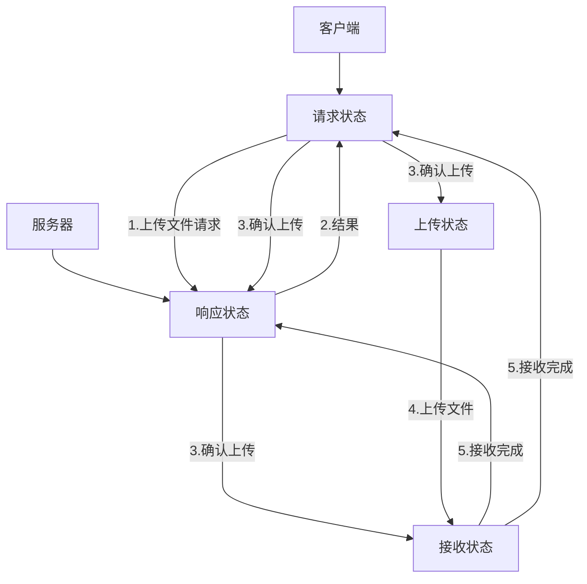
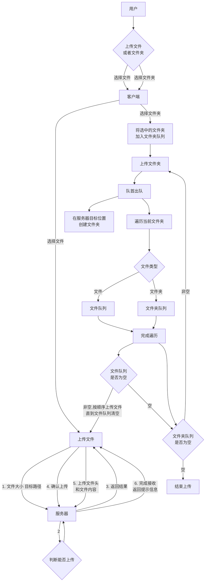
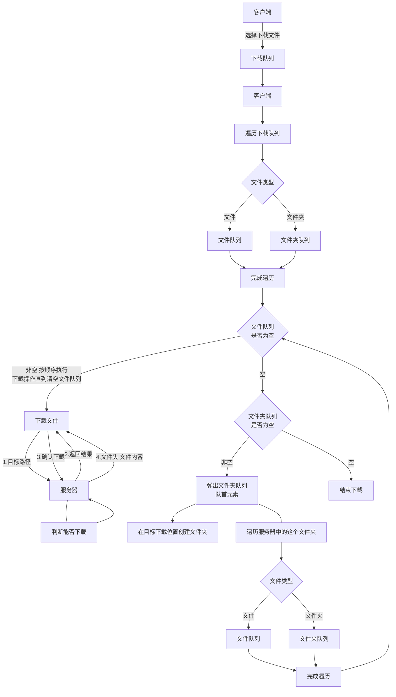

# tanCloud

## 简介
开发原因：第三方网盘数据不安全，容易泄露、被封禁；NAS成本高；很多开源私有网盘部署复杂，功能冗余。 

项目用途：本项目采用C/S架构，旨在实现一个简单、好用、跨平台的私有网盘。适合于个人、家庭、小型团队。可以用旧电脑或者价格较低的电脑充当服务器，再加上硬盘以较低的成本实现私有网盘。 
环境依赖：
- Qt5.15
- MSVC2019

## 项目设计
目前没有做界面部分代码，完成部分功能代码实现多线程服务器与单线程客户端（后续会完善成多线程客户端），自建通信协议实现客户端与服务器之间的通信以及文件传输。 

**相关代码功能在头文件中有详细注释。**
### 客户端
用户在地址框输入服务器IPv4地址或者域名，然后客户端对其进行验证，如果该地址合法，当用户点击连接服务器按钮时就对服务器发起连接请求，当与服务器成功建立连接后。 
用户输入用户名和密码进行登录注册操作。 
登录成功后，客户端跳转到主页面。
**客户端主要分为4个部分**
- 我的空间
  - 我的文件：主要实现用户对文件的操作以及展示服务器下的文件信息。
  - 我的分享：管理用户分享的文件。（暂时未实现）
  - 回收站：  暂时储存用户删除的文件，在一定时间内可以进行恢复。（暂时未实现）
- 传输：展示文件传输进度以及对传输的文件进行管理。（暂时未实现）
- 共享：类似于QQ群，共享空间内的成员可以下载空间内的文件，上传的文件通过审核后可以加入共享空间。成员可以删除自己上传的文件。（暂时未实现）
- 设置：主要是管理员对用户信息进行管理，比如用户空间大小分配等功能，暂时没想好。（暂时未实现）

#### 我的文件
- [x] 展示服务器下的文件夹中的内容
- [x] 通过复选框实现选中功能
- [x] 上传文件或者文件夹
- [x] 下载选中的文件或者文件夹
- [x] 新建文件夹
- [x] 删除选中的文件或者文件夹
- [x] 双击进入文件夹
- [x] 显示用户所在文件夹地址
- [x] 返回上一级地址
- [x] 刷新列表 
- [x] 页面跳转 
- [ ] 通过文件名搜索文件
- [ ] 切换列表排序方式
- [ ] 在表格展示方式与缩略图之间切换 

### 服务器
服务器程序运行后持续监听52996这个端口，当有新的连接请求到来时就为这个连接创建一个新的线程用来处理客户端请求。线程运行后，每当有可读信息就进行处理，并将处理结果返回给客户端。 

在整个项目中，信息分为两种。一种是请求信息，用来传递客户端的请求与服务器的处理结果。一种是文件信息，是服务器与客户端之间正在传输文件。 
同时客户端与服务器也分为接收请求状态与传输文件状态(客户端与服务器名称可能由区别)，状态之间的转换类似于tcp建立连接的过程。 

比如客户端要上传文件。首先发送文件传输请求，将文件信息上传给服务器。 
服务器判断这个文件能否上传，将结果返回给客户端。 
客户端将结果展示到界面，由用户决定是否上传。 
如果用户确认上传，则客户端发送确认信息给服务器，同时修改客户端状态为上传文件状态，然后上传文件。服务器收到确认信息后，修改服务器状态为接收文件状态。 
当服务器接收完成时，退出接收文件状态，发送接收完成信息给客户端，客户端退出上传状态。下载过程类似。

### 上传部分

### 下载部分
